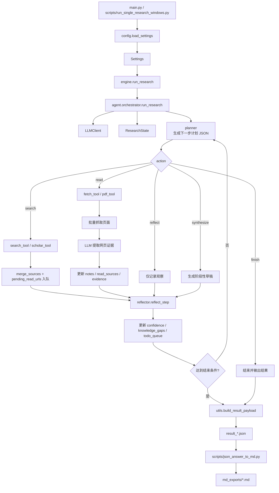
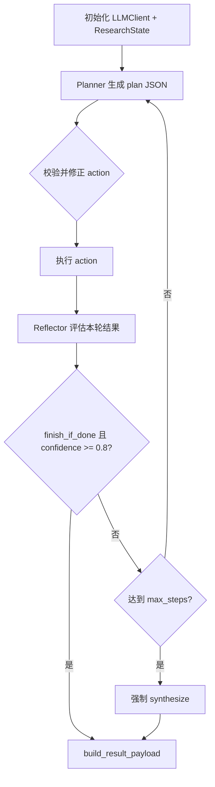
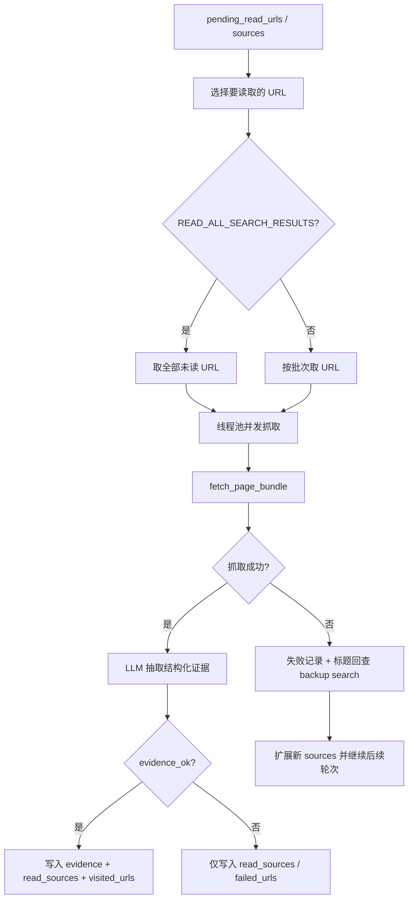
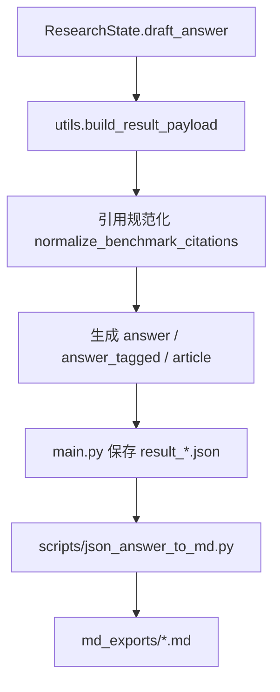

# My-DeepResearch-2 架构流程

本文档基于当前代码实现整理 `My-DeepResearch-2` 的整体架构、主流程、状态流转与输入输出路径，便于后续继续迭代、排查问题和补充能力。

## 1. 总体架构



## 2. 目录与模块职责

- `main.py`
  兼容入口，负责接收命令行参数、加载配置、调用研究主流程、保存结果 JSON。

- `scripts/run_single_research_windows.py`
  Windows 单题运行脚本，职责与 `main.py` 基本一致，更偏向日常实验和批量手动执行。

- `src/my_deepresearch/config.py`
  读取 `.env` 和兼容的 Alibaba 配置，生成 `Settings`。

- `src/my_deepresearch/engine.py`
  兼容层，目前只转发到 `agent.orchestrator.run_research`。

- `src/my_deepresearch/llm_client.py`
  OpenAI 兼容接口封装，统一进行 `chat.completions.create(...)` 调用。

- `src/my_deepresearch/prompts.py`
  存放 Planner、Reflector、Extractor、Synthesize 四类系统提示词。

- `src/my_deepresearch/agent/state.py`
  定义运行态对象 `ResearchState`，保存问题、步骤日志、来源、证据、反思结果、待读队列等。

- `src/my_deepresearch/agent/planner.py`
  把 `ResearchState` 压缩成可喂给规划器的 JSON 上下文。

- `src/my_deepresearch/agent/reflector.py`
  对每一步执行结果做充分性和置信度评估。

- `src/my_deepresearch/agent/orchestrator.py`
  整个系统的核心编排器，负责循环执行 `plan -> act -> reflect -> finish`。

- `src/my_deepresearch/agent/utils.py`
  提供 JSON 提取、去重、引用规范化、结果组装、来源挑选等通用能力。

- `src/my_deepresearch/tools/search_tool.py`
  Web 搜索工具，优先 Serper，失败回退 DDGS。

- `src/my_deepresearch/tools/scholar_tool.py`
  Scholar 搜索工具，当前通过 Serper Scholar 获取学术结果。

- `src/my_deepresearch/tools/fetch_tool.py`
  网页正文抓取工具，按 `PDF -> Jina -> requests + bs4 -> Wayback` 的顺序回退。

- `src/my_deepresearch/tools/pdf_tool.py`
  PDF 文本和标题提取工具。

- `scripts/json_answer_to_md.py`
  从结果 JSON 中抽取 `answer` 并导出为 Markdown。

## 3. 主执行流程

### 3.1 启动阶段

```text
用户输入问题
-> main.py / run_single_research_windows.py
-> load_settings()
-> run_research(question, settings)
```

启动阶段完成三件事：

1. 读取命令行参数，如 `question`、`cost_mode`、`search_mode`、`source_policy`。
2. 从 `.env` 和 Alibaba 兼容字段中组装 `Settings`。
3. 调用 `orchestrator.run_research(...)` 进入研究循环。

### 3.2 编排主循环

`orchestrator.run_research(...)` 的核心循环如下：



每一轮都包含以下阶段：

1. Planner 根据当前状态输出一个严格 JSON 计划。
2. Orchestrator 对计划做执行层修正。
3. 根据 `action` 调用搜索、读取、反思或综合写作逻辑。
4. Reflector 评估当前证据是否足够，并更新置信度与信息缺口。
5. 满足结束条件则输出结果，否则继续下一轮。

## 4. Action 路由与执行细节

### 4.1 `search`

输入：

- `plan.search_queries`
- `plan.search_mode`
- `settings.max_search_results`
- `settings.max_scholar_results`

执行逻辑：

1. 规划器给出 1 到 2 个搜索词。
2. 根据 `search_mode` 选择：
   - `web`
   - `scholar`
   - `hybrid`
3. 调用：
   - `search_tool.search_web(...)`
   - `scholar_tool.search_scholar(...)`
4. 通过 `merge_sources(...)` 合并到 `state.sources`。
5. 新发现的 URL 进入 `state.pending_read_urls`。

输出到状态：

- `sources`
- `pending_read_urls`
- `notes` 中的搜索错误
- `steps[*].new_results`

### 4.2 `read`

`read` 是当前系统里最复杂的一步，负责把“检索到的 URL”变成“可引用证据”。



抓取链路：

1. 若 URL 看起来是 PDF，优先直接解析 PDF。
2. 尝试 `Jina Reader`。
3. 回退到 `requests + BeautifulSoup`。
4. 若正文不可用，尝试 `Wayback Archive`。
5. 仍失败时触发“按标题回查”补救搜索。

证据判定：

- `fetch_ok`
  页面正文抓取成功，且文本长度足够。

- `evidence_ok`
  LLM 判断页面内容与问题相关，且抽取到有效事实。

- `read_ok = fetch_ok and evidence_ok`

写入策略：

- `read_sources`
  只要 `fetch_ok=True` 就可进入引用池。

- `evidence`
  只有 `read_ok=True` 才进入高质量证据池。

### 4.3 `reflect`

当规划器选择 `reflect` 时，不调用外部工具，只把当前观察交给 Reflector：

1. 汇总当前计划、观察、最近 notes、最近 sources。
2. 让 LLM 返回：
   - `is_sufficient`
   - `updated_gaps`
   - `next_hint`
   - `confidence`
3. 更新到 `state.reflections`、`state.knowledge_gaps`、`state.todo_queue`。

### 4.4 `synthesize`

`synthesize` 负责生成阶段性草稿：

1. 从 `evidence + read_sources + sources` 构建固定编号的引用目录。
2. 把 `notes / evidence / read_sources / sources` 一并提供给模型。
3. 要求模型输出：

```text
<think>...</think>
<answer>...</answer>
```

4. 草稿保存到 `state.draft_answer`，但不会立刻结束。

### 4.5 `finish`

如果规划器显式选择 `finish`，或者后续满足结束条件：

1. 若还没有草稿，先补做一次 `synthesize`。
2. 调用 `build_result_payload(state)` 规范化输出。
3. 返回最终 JSON。

## 5. 执行层的关键控制逻辑

这些逻辑不依赖 Planner 是否“聪明”，是当前系统稳定性的关键。

### 5.1 前 5 步强制至少 `read` 一次

如果前 5 步还没有出现过 `read`，而系统已经有可读 URL，则会把当前 action 强制改成 `read`。

目的：

- 避免系统只搜索不阅读。
- 保证至少形成一轮真实证据抽取。

### 5.2 搜索后优先进入阅读

若上一步是 `search` 且确实找到了新结果，并且存在 `pending_read_urls`，则下一步会优先改成 `read`。

目的：

- 防止 `search -> search -> search` 的堆积。
- 让搜索结果尽快转成证据。

### 5.3 读失败后的补救检索

当某个 URL 抓取失败时，系统会尝试：

1. 用原标题精确搜索。
2. 用“原标题 + 原域名”精确搜索。

目的：

- 修复失效链接。
- 通过备用网址或镜像页找回内容。

### 5.4 默认“全量读取搜索结果”

当前 `READ_ALL_SEARCH_RESULTS=1` 时：

- 一次 `read` 会尽量读取当前所有未读 URL。
- 并发数仍由 `BATCH_READ_MAX_WORKERS` 限制。

如果关闭该开关，则退回“分批读取”模式。

## 6. 核心状态对象 `ResearchState`

`ResearchState` 是整个系统的共享内存，主要字段如下：

- `question`
  用户原始问题。

- `steps`
  每一步执行日志，包含 action、why、queries、read 结果、reflection 等。

- `notes`
  页面摘要、失败原因、补救记录等非结构化观察。

- `sources`
  搜索阶段得到的全部来源。

- `read_sources`
  抓取成功的来源集合，可进入引用池。

- `evidence`
  既抓取成功又抽出有效事实的高质量证据。

- `reflections`
  每轮反思结果。

- `todo_queue`
  后续可继续补证的任务队列。

- `knowledge_gaps`
  当前尚未闭合的信息缺口。

- `visited_urls`
  已形成有效证据的 URL。

- `tried_urls`
  已尝试读取过的 URL。

- `failed_urls`
  抓取失败或低价值读取的 URL。

- `backup_queries`
  为失败链接触发过的补救检索词，避免重复回查。

- `pending_read_urls`
  待读 URL 队列。

- `confidence`
  当前收敛置信度。

- `draft_answer`
  阶段性草稿或最终答案。

## 7. 配置与环境变量流

配置优先级：

```text
CLI 显式参数
> 环境变量 MAX_* / SEARCH_MODE / SOURCE_POLICY
> COST_MODE 档位默认值
> 代码内默认值
```

环境变量来源：

1. 先加载本项目 `.env`
2. 若存在 `ALIBABA_ENV_PATH`，再加载该路径下 `.env`
3. 否则尝试加载同级 `Alibaba-NLP-DeepResearch/.env`

关键配置项：

- `OPENAI_API_KEY` / `API_KEY`
- `OPENAI_BASE_URL` / `API_BASE` / `INFER_API_BASE`
- `OPENAI_MODEL` / `INFER_MODEL_NAME` / `MODEL_PATH`
- `COST_MODE`
- `MAX_STEPS`
- `SEARCH_MODE`
- `SOURCE_POLICY`
- `SERPER_KEY_ID`
- `JINA_API_KEYS`
- `READ_ALL_SEARCH_RESULTS`
- `BATCH_READ_MAX_WORKERS`

## 8. 输出物与落盘流程



结果 JSON 主要字段：

- `prompt`
- `question`
- `answer`
- `answer_tagged`
- `article`
- `steps`
- `notes`
- `sources`
- `read_sources`
- `reflections`

其中：

- `answer`
  纯最终答案正文。

- `answer_tagged`
  保留 `<think>/<answer>` 结构，方便调试模型输出。

- `article`
  当前与 `answer` 保持一致，主要为评测链路兼容。

## 9. 当前实现的边界

从当前代码看，系统已经具备完整的单题深研闭环，但边界也比较明确：

- 目前是“单问题研究代理”，不是完整的多任务调度平台。
- 工具层以“搜索 + 网页读取 + PDF + Scholar”为主，暂未扩展 Office、表格、数据库类工具。
- 结果质量强依赖网页可读性、搜索召回质量和模型抽取稳定性。
- `read` 阶段虽然支持并发抓取，但证据抽取仍是串行 LLM 调用，速度与成本会随链接数增长。
- 引用格式已经对齐 Bench 风格，但仍可能受模型写作质量和来源标题质量影响。

## 10. 一句话总结

`My-DeepResearch-2` 当前是一个以 `orchestrator` 为核心、以 `ResearchState` 为共享状态、通过 `Planner -> Tool Execution -> Reflector -> Synthesize` 循环不断收敛答案的单题深度研究系统。
